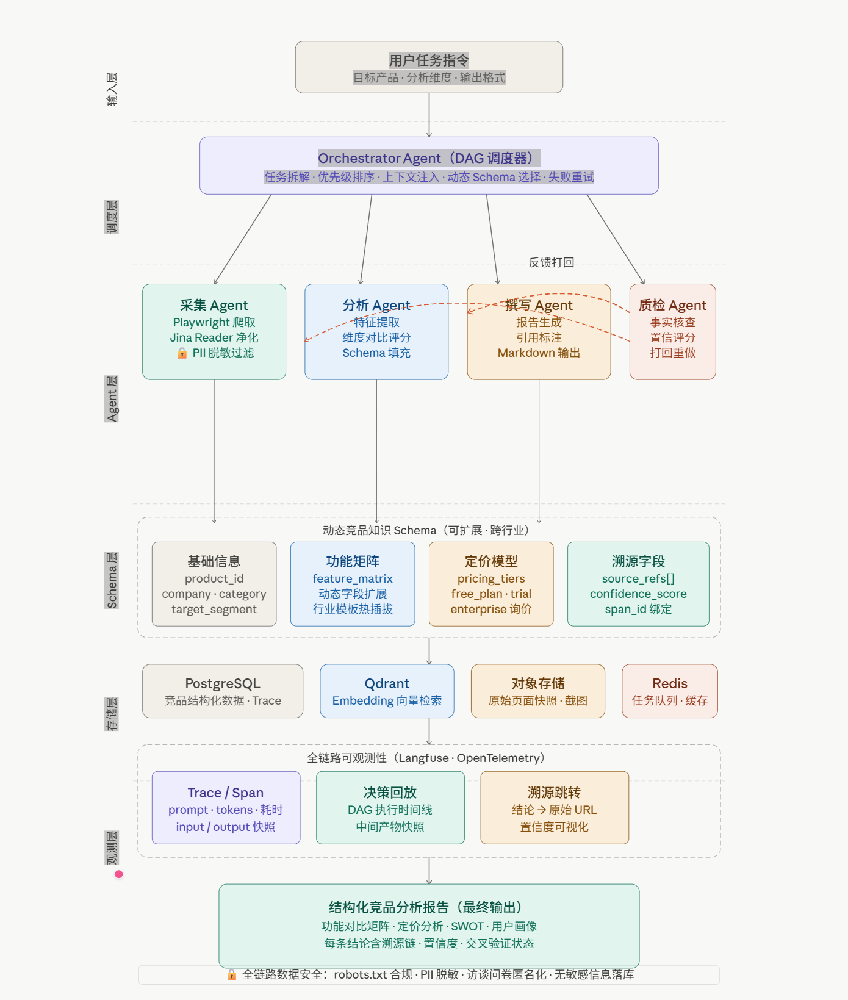

<p align="center">
  
  
  
  
  
  
</p>

# AgentDrivenCompetBench

> 多智能体驱动的竞品分析系统 —— 从数据采集到报告生成全链路自动化，QA 反馈闭环驱动迭代优化

<p align="center">
  
</p>

## 项目亮点

| 能力 | 实现方式 | 状态 |
|------|---------|------|
| 四 Agent 协作流水线 | LangGraph StateGraph + 条件路由边 | ✅ |
| QA 反馈闭环 + 迭代对比 | QA→Collector 自动路由 + 前后轮 delta 可视化 | ✅ |
| 扇出（Fan-out）并行采集 | asyncio.Semaphore(4) + 子任务 SSE 实时追踪 | ✅ |
| 双 LLM 智能路由 | Claude（高质量推理）+ DeepSeek（高性价比提取） | ✅ |
| 行业模板热插拔 | SaaS / 消费品 / 硬件 三套模板，运行时注入 | ✅ |
| Agent 调用链可观测 | 内嵌耗时 / Token / 成本统计 + Langfuse 一键跳转 | ✅ |
| 全链路证据溯源 | EvidencedClaim 携带 URL + 原文片段 + 快照哈希 | ✅ |
| 实时 SSE 流式展示 | 9 种事件类型，前端 DAG / 日志 / 进度同步更新 | ✅ |
| 测试覆盖 | 49 个测试用例（校验器 / Schema / 路由 / 扇出） | ✅ |

---

## 演示数据

```
输入：竞品 "ClickUp" + 维度[pricing, features] + 行业模板[SaaS]
输出：2500+ 字结构化报告 | 14-47 条带溯源的 claims | QA 评分 0.68-0.78
耗时：约 110 秒（4 个 agent 串行）| 单次成本 < $0.01（DeepSeek）
```

---

## 系统架构

```
┌─────────────────────────────────────────────────────────────────┐
│                        Vue 3 前端                                 │
│  ┌──────────┐ ┌──────────┐ ┌────────────┐ ┌───────────────┐   │
│  │ DAG 视图 │ │实时日志  │ │迭代时间线  │ │ Agent 调用链  │   │
│  │          │ │          │ │(前后对比)  │ │(Token/成本)   │   │
│  └──────────┘ └──────────┘ └────────────┘ └───────────────┘   │
└────────────────────────────┬────────────────────────────────────┘
                             │ SSE（9 种事件类型）
┌────────────────────────────▼────────────────────────────────────┐
│                     FastAPI 后端                                  │
│  POST /analyze  │  GET /stream  │  GET /templates                │
└────────────────────────────┬────────────────────────────────────┘
                             │
┌────────────────────────────▼────────────────────────────────────┐
│                 LangGraph 状态图                                  │
│                                                                  │
│  ┌───────────┐    ┌──────────┐    ┌────────┐    ┌────┐         │
│  │ 采集 Agent│───▶│分析 Agent│───▶│写作 ag.│───▶│ QA │         │
│  │(扇出 ×4)  │    │          │    │        │    │    │         │
│  └───────────┘    └──────────┘    └────────┘    └──┬─┘         │
│       ▲                                            │            │
│       └────────── 打回（缺失维度）─────────────────┘            │
│                                                    │            │
│                              通过 / 拒绝 ──────────▶ END        │
└─────────────────────────────────────────────────────────────────┘
         │                    │                │
    ┌────▼────┐         ┌────▼────┐     ┌────▼────┐
    │Jina     │         │Claude   │     │Langfuse │
    │Reader   │         │DeepSeek │     │Cloud    │
    │+PW 降级 │         │(双路由) │     │(追踪)   │
    └─────────┘         └─────────┘     └─────────┘
```

---

## 技术选型

| 层级 | 技术 | 选型理由 |
|------|------|---------|
| 编排 | LangGraph StateGraph | 声明式 DAG + 条件路由边，原生支持循环 |
| LLM 路由 | Claude + DeepSeek | 推理质量与性价比按任务类型分流 |
| 后端 | FastAPI + SSE | 异步非阻塞 + 原生流式推送 |
| 前端 | Vue 3 + Vite + Tailwind + Vue Flow | 响应式 DAG 可视化 |
| 数据采集 | Jina Reader + Playwright 降级 | 轻量优先，JS 渲染兜底 |
| 可观测性 | Langfuse v4 | trace → span → generation 三层追踪 |
| 数据校验 | Pydantic v2 | 结构化输出 + 运行时校验 |
| 测试 | pytest + pytest-asyncio | 49 个用例，5 秒全量通过 |

---

## 快速开始

### 环境要求

- Python 3.11+ / Node.js 18+ / Docker
- API 密钥：Anthropic + DeepSeek + Langfuse

### 安装步骤

```bash
git clone https://github.com/kbob3687-hub/AgentDrivenCompetBench.git
cd AgentDrivenCompetBench

cp .env.example .env   # 填入 API 密钥

pip install -e ".[dev]"
docker compose up -d   # 启动 PostgreSQL + Qdrant

# 启动后端
uvicorn src.api.app:app --host 0.0.0.0 --port 8001

# 启动前端
cd frontend && npm install && npm run dev
```

浏览器访问 http://localhost:5173 开始分析。

---

## 核心设计

### 一、QA 反馈闭环

```
第 1 轮：评分 0.52，判定=打回，缺失维度=[integrations]
     ↓ 自动路由回采集 Agent 补充采集
第 2 轮：评分 0.76，判定=通过 ✓
     ↓
前端迭代时间线展示前后对比：+24% ↑
```

QA Agent 采用双阶段审核：
- **规则校验**：维度覆盖率、来源完整性、置信度阈值、Schema 一致性
- **LLM 语义审核**：逻辑连贯性、论据充分性、事实准确性

### 二、扇出（Fan-out）并行采集

采集 Agent 对每个 URL 启动独立子任务，`asyncio.Semaphore(4)` 控制并发上限：

```
fetch-0: notion.so/pricing     ──┐
fetch-1: notion.so/product     ──┼── 并行执行，SSE 实时上报进度
fetch-2: notion.so/integrations──┘
```

每个子任务的生命周期通过 `sub_agent_start` / `sub_agent_end` 事件推送到前端。

### 三、行业模板系统

```python
# 运行时注入行业特定维度
template = load_template("saas")      # → API 开放度、集成数、AI 能力……
template = load_template("consumer")  # → 品牌定位、渠道策略……
template = load_template("hardware")  # → 供应链、认证资质……
```

模板字段会自动注入到采集 Agent 的指令和 QA 维度覆盖检查中。

### 四、Agent 调用链可观测

前端内嵌调用链面板，无需切换工具即可查看：
- 每个 Agent 的耗时、模型、输入 / 输出 Token 数
- 预估成本（按 DeepSeek / Claude 分别计价）
- Prompt / 输出预览（前 200 / 300 字符）
- Langfuse 一键跳转查看完整调用链

---

## 接口文档

| 方法 | 端点 | 说明 |
|------|------|------|
| `POST` | `/api/analyze` | 创建分析任务 |
| `GET` | `/api/analyze/{task_id}` | 查询任务状态与结果 |
| `GET` | `/api/analyze/{task_id}/stream` | SSE 实时事件流 |
| `GET` | `/api/analyze/templates` | 列出可用行业模板 |
| `GET` | `/api/analyze/templates/{industry}` | 获取指定模板 Schema |

### 请求示例

```json
{
  "competitor_name": "Notion",
  "dimensions": ["pricing", "features", "integrations"],
  "industry": "saas",
  "max_iterations": 3
}
```

### SSE 事件类型

| 事件 | 数据载荷 | 说明 |
|------|---------|------|
| `agent_start` | `{agent, iteration}` | Agent 开始执行 |
| `agent_end` | `{agent, iteration, duration_ms}` | Agent 执行完成 |
| `sub_agent_start` | `{parent, sub_id, url}` | 子采集任务启动 |
| `sub_agent_end` | `{sub_id, success, claims_count}` | 子采集任务完成 |
| `log` | `{message, agent}` | 运行日志 |
| `qa_verdict` | `{verdict, score, missing_dimensions}` | QA 评审结果 |
| `iteration_summary` | `{iteration, score, issues_count}` | 迭代轮次摘要 |
| `complete` | `{report_markdown, agent_traces, ...}` | 任务完成 |
| `error` | `{message}` | 错误信息 |

---

## 项目结构

```
src/
├── agents/
│   ├── base.py                 # BaseAgent 基类（Langfuse 追踪 + 重试 + 双 LLM）
│   ├── collector/              # 数据采集（Jina Reader + Playwright + LLM 抽取）
│   ├── analyst/                # 结构化分析（claims → CompetitorProfile）
│   ├── writer/                 # 报告生成（profile → Markdown + 脚注）
│   └── qa/                     # 质量审核（规则校验器 + LLM 语义审核）
├── orchestrator/
│   ├── state.py                # GraphState（TypedDict，共享状态容器）
│   ├── graph.py                # build_graph() 独立版
│   └── edges.py                # qa_routing() 条件路由
├── schemas/
│   ├── competitor.py           # CompetitorProfile、EvidencedClaim、FeatureNode……
│   ├── extensions.py           # IndustryTemplate 行业模板系统
│   └── message.py              # AgentMessage 函数调用协议
└── api/
    ├── app.py                  # FastAPI 入口
    ├── runner.py               # SSE 版流水线（事件发布 + 调用链收集）
    ├── events.py               # EventBus（每任务独立 asyncio.Queue）
    └── routes/analyze.py       # REST + SSE 路由

frontend/src/
├── components/
│   ├── DagView.vue             # Agent DAG 可视化（Vue Flow）
│   ├── LogStream.vue           # 实时日志流
│   ├── IterationTimeline.vue   # QA 迭代进度 + 前后对比
│   ├── ResultPanel.vue         # 报告 + Agent 调用链 + 反馈历史
│   └── AnalysisForm.vue        # 输入表单 + 行业模板选择
├── composables/
│   ├── useSSE.ts               # SSE 连接管理
│   └── useAnalysis.ts          # 状态机 + 事件分发
└── types/index.ts              # TypeScript 类型定义

tests/
├── test_qa_validators.py       # 15 个用例 - QA 规则校验器
├── test_schemas.py             # 12 个用例 - 数据模型 + 行业模板
├── test_orchestrator.py        # 9 个用例  - 图路由 + 状态结构
├── test_fan_out_subagent.py    # 11 个用例 - 并行采集模式
└── conftest.py                 # 共享 fixtures
```

---

## 测试与开发

```bash
pytest tests/ -v          # 49 个用例，约 5 秒
ruff check src/ --fix     # 代码检查
ruff format src/          # 格式化
```

测试覆盖范围：
- **QA 校验器**：维度覆盖、来源校验、片段真实性、一致性检查、置信度阈值
- **Schema**：EvidencedClaim 构造、行业模板加载 / 校验 / 列举
- **编排器**：qa_routing 五种路径、图结构验证、FeedbackRecord 序列化
- **扇出采集**：并行执行、失败容错、信号量并发控制、URL 生成

---

## 路线图

- [x] 四 Agent 流水线（Collector → Analyst → Writer → QA）
- [x] LangGraph StateGraph + QA 反馈闭环
- [x] FastAPI + SSE 实时流式接口
- [x] Vue 3 前端 DAG 可视化
- [x] 扇出并行采集 + 子任务追踪
- [x] 行业模板热插拔（SaaS / 消费品 / 硬件）
- [x] Agent 调用链面板 + Langfuse 集成
- [x] QA 迭代前后对比展示
- [x] 测试套件（49 个用例）
- [ ] 向量检索增强（Qdrant RAG）
- [ ] 多竞品横向对比视图
- [ ] 导出 PDF / PPT

---

## 许可证

MIT

---

<p align="center">
  <sub>基于 LangGraph + Claude + DeepSeek + Vue 3 构建 | 多智能体协作 × 反馈闭环 × 全链路可观测</sub>
</p>
