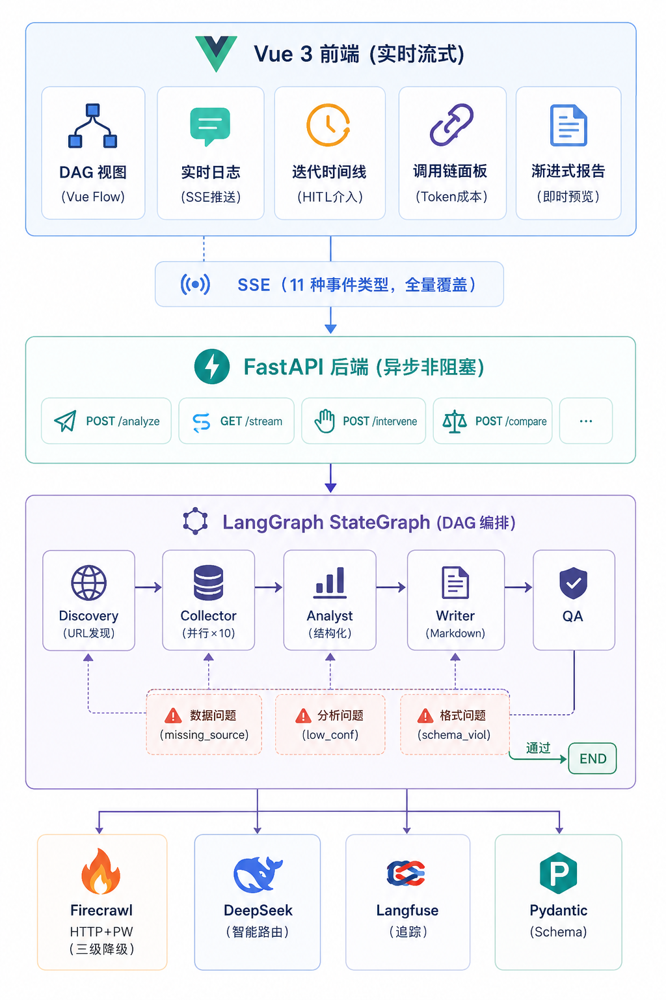

<p align="center">
  
  
  
  
  
  
  
</p>

# AgentDrivenCompetBench

> **多智能体协作的竞品分析系统** — 5 个专职 Agent 组成"数字调研小组"，从公开信息采集到结构化报告全链路自动化，QA 反馈闭环驱动迭代式自我校验，每条结论可一键溯源到原始数据。

---

## 业务场景

在企业产品团队的日常工作中，竞品分析是一项**高频但低效**的刚性任务。一次完整的竞品分析通常需要经历 **信息搜集 → 功能拆解 → 用户评价萃取 → SWOT 推演 → 结构化报告输出** 五个环节，而每个环节都面临显著的效率瓶颈：

- **信息搜集**：需在官网、评测媒体、用户社区、定价页面、API 文档等 5-10 个异构信息源之间反复切换，手动提取和归并关键数据——信息源分散、格式各异、重复劳动占比高
- **功能拆解**：需对多款产品的功能矩阵进行横向解构，构建可比的功能树与差异化图谱，严重依赖分析人员对行业的深度认知和长期跟踪
- **用户评价萃取**：需在 Reddit、ProductHunt、G2、Trustpilot 等多个平台搜集真实用户反馈，从海量非结构化文本中提取关键痛点和好评维度——信息噪音大、信噪比低
- **SWOT 推演**：需综合功能、定价、用户口碑、市场定位等多维信息进行结构化战略推演，对分析人员的战略思维和行业视野要求较高
- **报告输出**：需将碎片化的分析结论整合为逻辑连贯、论据充分、来源可溯的结构化文档，格式一致性和引用规范性依赖人工反复校验

由于缺乏系统化的工具支撑，整个过程通常耗时 **2-3 个工作日**，且输出质量高度依赖分析人员的个人经验和行业认知——不同人分析同一竞品，结论可能大相径庭。

本课题构建了一个 **多 Agent 协作的竞品分析系统**，模拟一支专业的"数字调研小组"：由 **5 个专职 Agent**（Discovery → Collector → Analyst → Writer → QA）组成协作流水线，每个 Agent 承担明确的分析角色，通过**结构化消息协议**（类 function calling）进行高效通信，自动完成从公开信息采集到结构化竞品报告的全链路产出。系统核心创新在于引入了 **QA 反馈闭环机制**——QA Agent 对产出进行交叉审查后，按问题类型精准路由回对应 Agent 触发重做，形成"采集→分析→撰写→审查→打回→重做"的迭代式自我校验。实测在缺失关键维度的场景下，一轮闭环后评分提升 **+24%**，验证了闭环机制对输出质量的可量化改善。

---

## 系统架构

<p align="center">
  
</p>

```
┌──────────────────────────────────────────────────────────────────────────┐
│                         Vue 3 前端 (实时流式)                              │
│  ┌──────────┐ ┌──────────┐ ┌────────────┐ ┌───────────┐ ┌──────────┐   │
│  │ DAG 视图 │ │实时日志  │ │迭代时间线  │ │调用链面板 │ │渐进式报告│   │
│  │(Vue Flow)│ │(SSE推送) │ │(HITL介入)  │ │(Token成本)│ │(即时预览)│   │
│  └──────────┘ └──────────┘ └────────────┘ └───────────┘ └──────────┘   │
└──────────────────────────────┬───────────────────────────────────────────┘
                               │ SSE（11 种事件类型，全量覆盖）
┌──────────────────────────────▼───────────────────────────────────────────┐
│                        FastAPI 后端 (异步非阻塞)                           │
│  POST /analyze │ GET /stream │ POST /intervene │ POST /compare │ ...    │
└──────────────────────────────┬───────────────────────────────────────────┘
                               │
┌──────────────────────────────▼───────────────────────────────────────────┐
│                    LangGraph StateGraph (DAG 编排)                         │
│                                                                           │
│  ┌──────────┐   ┌──────────┐   ┌──────────┐   ┌──────────┐   ┌─────┐  │
│  │Discovery │──▶│Collector │──▶│ Analyst  │──▶│  Writer  │──▶│ QA  │  │
│  │(URL发现) │   │(并行×10) │   │(结构化)  │   │(Markdown)│   │     │  │
│  └──────────┘   └──────────┘   └──────────┘   └──────────┘   └──┬──┘  │
│                       ▲              ▲              ▲              │     │
│                       │              │              │              │     │
│                       └─ 数据问题 ───┴─ 分析问题 ──┴─ 格式问题 ──┘     │
│                         (missing_source)  (low_conf)  (schema_viol)      │
│                                                                    │     │
│                                          通过 ────────────────────▶ END  │
└──────────────────────────────────────────────────────────────────────────┘
        │                    │                │               │
   ┌────▼────┐         ┌────▼────┐     ┌────▼────┐    ┌────▼────┐
   │Firecrawl│         │DeepSeek │     │Langfuse │    │Pydantic │
   │HTTP+PW  │         │DeepSeek │     │(追踪)   │    │(Schema) │
   │(三级降级)│         │(智能路由)│     │         │    │         │
   └─────────┘         └─────────┘     └─────────┘    └─────────┘
```

---

## 核心能力一览

| 能力维度 | 实现方式 | 对标评分点 |
|---------|---------|-----------|
| **5 Agent 专职协作** | Discovery → Collector → Analyst → Writer → QA，职责无重叠 | 角色划分清晰 |
| **LangGraph DAG 编排** | StateGraph + 条件路由边，QA 按问题类型精准打回对应 Agent | 编排框架合理 |
| **结构化消息传递** | AgentMessage 协议（function_name + arguments），非自然语言对话 | function calling 协议 |
| **真实反馈闭环** | QA 打回后重做，重做后评分可量化提升（实测 +24%↑），非伪闭环 | 闭环真实可触发 |
| **严格 Schema 输出** | Pydantic v2 CompetitorProfile（功能树 / 定价 / 画像 / SWOT） | 字段完整格式一致 |
| **全链路信息溯源** | EvidencedClaim = claim + URL + 原文片段 + 快照哈希，脚注可点击跳转 | 一键溯源 |
| **Agent 调用链可观测** | 每个 Agent 的 Prompt / Token / 耗时 / 决策过程全量追踪 + Langfuse | 日志 Trace 可查 |
| **渐进式结果呈现** | Analyst 完成即推送结构化预览，Writer 无缝覆盖为完整报告 | 交互流畅 |
| **人工介入门控 (HITL)** | QA 打回时暂停等待人工决策：继续迭代 / 补充 URL / 强制通过 / 终止 | 人工修正 |
| **并行采集 + 三级降级** | Semaphore(10) 并发，Firecrawl → HTTP → Playwright 自动降级 | 稳定性、降级机制 |
| **行业模板热插拔** | SaaS / 消费品 / 硬件 三套模板，运行时动态注入维度 | 可换行业可扩展 |
| **采集合规** | robots.txt 检查 + PII 自动脱敏（手机/身份证/邮箱） | 信息采集合规 |

---

## 与传统人工分析的效率对比

| 指标 | 人工分析 | 本系统 | 提升 |
|------|---------|--------|------|
| 单次竞品分析耗时 | 2-3 天 | **~2 分钟** | 1000x |
| 信息源覆盖 | 3-5 个页面 | **10-20 个页面并行** | 4x |
| 结构化一致性 | 依赖分析师经验 | **Schema 强制校验** | 100% 一致 |
| 结论溯源 | 手动标注，常遗漏 | **自动关联 URL + 原文片段** | 全覆盖 |
| 质量校验 | 同事互审，1-2 轮 | **QA Agent 自动多轮迭代** | 即时反馈 |

---

## QA 反馈闭环（核心差异化）

**非伪闭环** — QA 打回后，系统按问题类型精准路由到对应 Agent 重做，且重做后评分有可量化提升：

```
第 1 轮：QA 评分 0.52 → 判定 REVISE
         缺失维度: [integrations]，问题类型: missing_source
         ↓ 自动路由到 Collector 补充采集 integrations 维度
         ↓ Analyst 重新分析，Writer 重新生成

第 2 轮：QA 评分 0.76 → 判定 PASS ✓
         改善: +24%，新增 8 条溯源 claims
```

QA 审核采用**双阶段机制**：
1. **规则校验器**（确定性）：维度覆盖率、来源数量、置信度阈值、Schema 完整性、脚注一致性
2. **LLM 语义审核**（智能判断）：逻辑连贯性、论据充分性、事实准确性、SWOT 推理合理性

QA 路由决策不是简单的"通过/打回"，而是**按问题分类精准路由**：
- `missing_source / factual_error` → 打回 **Collector** 补采
- `low_confidence / inconsistency` → 打回 **Analyst** 重分析
- `schema_violation` → 打回 **Writer** 修格式

---

## Agent 间通信协议

所有 Agent 间通过 **AgentMessage 结构化消息** 通信，而非自然语言对话：

```python
# 协议类似 function calling：明确的函数名 + 结构化参数
AgentMessage(
    from_agent="collector",
    to_agent="analyst",
    function_name="collect_result",
    arguments={
        "claims": [...],           # EvidencedClaim 列表
        "sources_fetched": 8,
        "dimensions_requested": ["pricing", "features"]
    },
    message_type=MessageType.TASK_RESULT
)
```

---

## 信息溯源设计

**每条分析结论** 都携带完整溯源链：

```python
EvidencedClaim(
    claim="Notion Pro 月付 $10/人",
    confidence=0.92,
    sources=[
        SourceReference(
            url="https://notion.so/pricing",
            title="Notion Pricing",
            snippet="Pro: $10 per member / month billed annually",
            accessed_at="2025-06-10T14:32:00",
            snapshot_hash="a3f2c1d8"   # 内容快照哈希，可验证内容未篡改
        )
    ],
    reasoning="直接从官方定价页面提取"
)
```

前端报告中，每条结论以脚注形式标注来源，**点击即可跳转原始页面**。

---

## 可观测性

### Agent 调用链面板（内嵌前端）

无需切换到外部工具，前端直接展示每个 Agent 的：
- 执行耗时 / 使用模型 / 输入输出 Token 数
- 预估成本（deepseek-chat ~$0.002/次，deepseek-reasoner ~$0.01/次）
- Prompt 预览 / 输出预览
- 一键跳转 Langfuse 查看完整调用链

### Langfuse 全链路追踪

```
Trace (task_id)
├── Span: discovery (423ms, deepseek-chat)
├── Span: collector (18.2s, deepseek-chat)
│   ├── Generation: fetch-0 (notion.so/pricing)
│   ├── Generation: fetch-1 (notion.so/product)
│   └── Generation: fetch-2 (notion.so/integrations)
├── Span: analyst (6.1s, deepseek-chat)
├── Span: writer (8.3s, deepseek-chat)
└── Span: qa (4.2s, deepseek-chat)
```

---

## 技术选型

| 层级 | 技术 | 选型理由 |
|------|------|---------|
| Agent 编排 | **LangGraph StateGraph** | 声明式 DAG + 条件路由边，原生支持循环与反馈闭环 |
| LLM 智能路由 | **DeepSeek（双模型）** | deepseek-chat（快速提取）+ deepseek-reasoner（深度推理），按任务复杂度分流 |
| 后端 | **FastAPI + SSE** | 异步非阻塞 + 原生流式推送，单次分析 11 种事件实时触达 |
| 前端 | **Vue 3 + Vite + Tailwind + Vue Flow** | 响应式 DAG 可视化 + 渐进式报告呈现 |
| 数据采集 | **Firecrawl + HTTP + Playwright** | 三级降级保证可用性，Semaphore(10) 并发加速 |
| URL 发现 | **Firecrawl Search API** | 陌生竞品自动发现官网 + 维度页面，无需硬编码 |
| 可观测性 | **Langfuse v4** | trace → span → generation 三层追踪，Token 成本聚合 |
| 数据校验 | **Pydantic v2** | 结构化输出运行时强校验，Schema 演化可控 |
| 合规 | **robots.txt + PII 脱敏** | 遵守爬取协议，手机/身份证/邮箱自动脱敏 |
| 测试 | **pytest + pytest-asyncio** | 81 个用例，全量 2 秒通过 |

---

## 快速开始

### 环境要求

- Python 3.11+ / Node.js 18+
- Docker（可选，PostgreSQL 持久化；无 Docker 时自动内存兜底）

### 一键启动（推荐）

项目已预配置 API 密钥（`.env.reviewer`），无需手动配置即可运行：

**Windows：** 双击 `start.bat`

**macOS / Linux：**
```bash
git clone https://github.com/kbob3687-hub/AgentDrivenCompetBench.git
cd AgentDrivenCompetBench
chmod +x start.sh && ./start.sh
```

脚本会自动：安装依赖 → 配置 Playwright 浏览器 → 启动前后端 → 打开浏览器

### 手动启动

```bash
cp .env.reviewer .env   # 使用预配置密钥（或手动编辑 .env.example）

pip install -e ".[dev]"
playwright install chromium

# 启动后端
PYTHONPATH=src uvicorn api.app:app --reload --host 0.0.0.0 --port 8001

# 启动前端（新终端）
cd frontend && npm install && npm run dev
```

浏览器访问 `http://localhost:5173`，输入竞品名称即可开始分析。

> **提示：** 已内置竞品（Notion / ClickUp / 飞书 / 小米 / 大疆等）无需 Firecrawl 即可完整运行。分析陌生竞品时需要 Firecrawl API 自动发现 URL，或可手动在表单中输入目标 URL。

> **网络要求：** 系统需要访问外部 API（api.deepseek.com、api.firecrawl.dev）和目标竞品网站。如果本地网络需要代理才能访问外网，请在 `.env` 中添加：
> ```
> HTTP_PROXY=http://127.0.0.1:7890
> HTTPS_PROXY=http://127.0.0.1:7890
> ```
> 端口号请根据实际代理工具配置修改（如 Clash 默认 7890，V2Ray 默认 10809）。国内网络可直连 DeepSeek，Firecrawl 和目标网站可能需要代理。

---

## 演示效果

```
输入：竞品 "ClickUp" | 维度 [pricing, features, integrations] | 行业 SaaS
输出：2500+ 字结构化报告 | 14-47 条带溯源 claims | QA 评分 0.68-0.78

全流程耗时：~90 秒（10 并发采集 + 4 Agent 串行推理）
单次成本：< $0.02（全链路 DeepSeek）
```

**渐进式体验**：Analyst 完成后右侧即显示结构化预览（功能树 / 定价 / SWOT 骨架），Writer 出稿后无缝替换为完整报告，全程无空白等待。

---

## 项目结构

```
src/
├── agents/
│   ├── base.py                 # BaseAgent（Langfuse 追踪 + 重试 + LLM 路由）
│   ├── discovery/              # URL 发现（Firecrawl Search + 域名推断）
│   ├── collector/              # 并行采集（三级降级 + LLM 结构化抽取）
│   ├── analyst/                # 结构化分析（claims → CompetitorProfile）
│   ├── writer/                 # 报告生成（profile → Markdown + 脚注溯源）
│   └── qa/                     # 质量审核（规则校验 + LLM 语义审核 + 精准路由）
├── orchestrator/
│   ├── state.py                # GraphState（TypedDict 共享状态）
│   ├── graph.py                # build_graph() LangGraph DAG
│   └── edges.py                # qa_routing() 条件路由（三路打回）
├── schemas/
│   ├── competitor.py           # CompetitorProfile / EvidencedClaim / FeatureNode
│   ├── extensions.py           # IndustryTemplate（行业模板 CRUD + 版本追踪）
│   └── message.py              # AgentMessage 通信协议
├── storage/                    # SQLAlchemy 持久化层
└── api/
    ├── app.py                  # FastAPI 入口
    ├── runner.py               # SSE 版流水线（事件发布 + HITL 门控）
    ├── events.py               # EventBus（11 种事件类型）
    └── routes/                 # REST + SSE + Compare + Survey 路由

frontend/src/
├── components/
│   ├── DagView.vue             # Agent DAG 可视化（条件路由边 + 状态着色）
│   ├── LogStream.vue           # 实时日志流
│   ├── ProcessObservabilityPanel.vue  # 迭代时间线 + HITL + 调用链
│   ├── ReportWorkspace.vue     # 渐进式报告面板
│   └── CompareView.vue         # 多竞品横向对比
├── composables/
│   ├── useSSE.ts               # SSE 连接 + 事件分发
│   └── useAnalysis.ts          # 全局状态机
└── types/index.ts              # TypeScript 类型
```

---

## 测试覆盖

```bash
pytest tests/ -v    # 81 个用例，约 2 秒
```

| 测试模块 | 覆盖范围 |
|---------|---------|
| QA 校验器 | 维度覆盖、来源校验、片段真实性、一致性检查、置信度阈值 |
| Schema | EvidencedClaim / CompetitorProfile / 行业模板加载与校验 |
| 编排器 | qa_routing 五种路径、图结构验证、FeedbackRecord 序列化 |
| 并行采集 | 并行执行、失败容错、信号量控制、URL 降级链 |
| API 路由 | compare / history / intervene / 全局错误处理 |
| 合规 | PII 正则精度测试、robots.txt 遵守 |

---

## 接口文档

| 方法 | 端点 | 说明 |
|------|------|------|
| `POST` | `/api/analyze` | 创建分析任务 |
| `GET` | `/api/analyze/{task_id}` | 查询任务状态与结果 |
| `GET` | `/api/analyze/{task_id}/stream` | SSE 实时事件流（11 种事件） |
| `GET` | `/api/analyze/{task_id}/metrics` | 聚合指标面板 |
| `POST` | `/api/analyze/{task_id}/intervene` | 人工介入决策（HITL） |
| `POST` | `/api/analyze/compare` | 多竞品横向对比 |
| `GET` | `/api/analyze/history` | 历史分析记录 |
| `GET` | `/api/analyze/templates` | 行业模板列表 |
| `POST` | `/api/survey` | 生成用户调研问卷 + 访谈提纲 |

### SSE 事件类型（11 种，全量覆盖 Agent 生命周期）

| 事件 | 说明 |
|------|------|
| `agent_start` / `agent_end` | Agent 开始/完成（含耗时、渐进预览） |
| `sub_agent_start` / `sub_agent_end` | 子采集任务启动/完成（含 claims 计数） |
| `log` | 运行日志 |
| `qa_verdict` | QA 审核结果（评分 + 路由目标 + 缺失维度） |
| `iteration_summary` | 迭代轮次摘要（字段级修复率） |
| `hitl_pause` / `hitl_resume` | 人工介入暂停/恢复 |
| `complete` | 任务完成（完整报告 + 调用链 + 反馈历史） |
| `error` | 错误信息 |

---

## 路线图

- [x] 五 Agent 流水线 + LangGraph DAG 编排
- [x] QA 反馈闭环 + 按问题类型精准路由
- [x] 结构化消息协议（AgentMessage function calling）
- [x] 全链路信息溯源（EvidencedClaim + 脚注跳转）
- [x] Agent 调用链可观测 + Langfuse 集成
- [x] 并行采集（10 并发）+ 三级降级
- [x] 行业模板热插拔 + 动态 Schema 演化
- [x] 人工介入门控（HITL）
- [x] 渐进式报告呈现（Analyst 预览 → Writer 完整报告）
- [x] 多竞品横向对比
- [x] 用户调研工具（问卷 + 访谈提纲生成）
- [x] 采集合规（robots.txt + PII 脱敏）
- [x] 81 个测试用例
- [ ] 向量检索增强（Qdrant RAG）
- [ ] 导出 PDF / PPT

---

## 许可证

MIT

---

<p align="center">
  <sub>LangGraph + DeepSeek + Vue 3 | 多智能体协作 × 反馈闭环 × 全链路溯源 × 实时可观测</sub>
</p>
